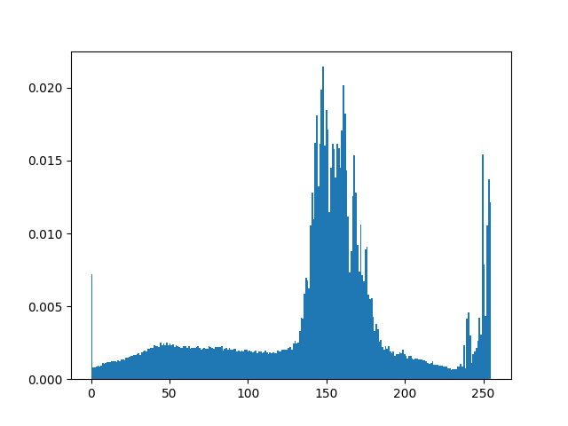
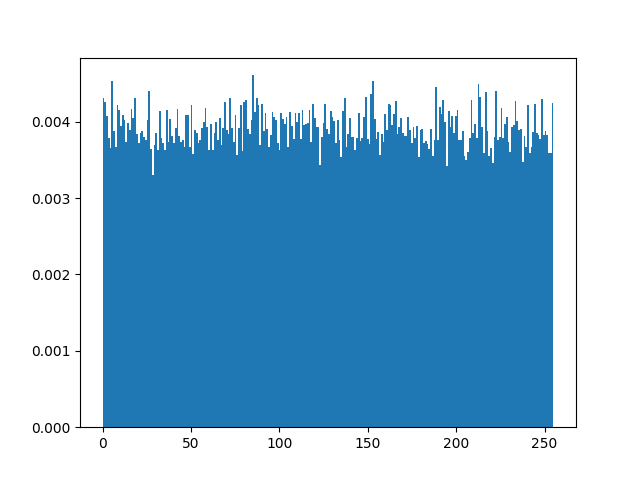

# True Random Number Generator

Eksperymentalny generator próbek liczbowych z obrazu wideo, napisany w **Pythonie, NumPy i OpenCV**, z panelem Streamlit. Kod filtruje wartości pikseli, pobiera ich dwa najmłodsze bity, przestawia próbki i składa je w większe słowa.

Repozytorium odwołuje się do pracy [„A True Random Number Generator algorithm from digital camera image noise for varying lighting conditions”](https://www.researchgate.net/publication/283021854_A_True_Random_Number_Generator_algorithm_from_digital_camera_image_noise_for_varying_lighting_conditions). Poniższy opis dotyczy konkretnego kodu w `trng.py`; nie zakłada pełnej zgodności z publikacją ani certyfikacji źródła entropii.

**Zapisany film daje deterministyczne wyniki przy tym samym dekodowaniu i przebiegu programu.** Może zawierać zarejestrowany szum, lecz jego ponowny odczyt nie tworzy świeżej losowości. Nazwa projektu opisuje intencję eksperymentu, nie wykazaną gwarancję kryptograficzną.

## Spis treści

- [Przepływ danych](#przepływ-danych)
- [Algorytm ekstrakcji krok po kroku](#algorytm-ekstrakcji-krok-po-kroku)
- [Składanie liczby z dwubitowych próbek](#składanie-liczby-z-dwubitowych-próbek)
- [Entropia i testy](#entropia-i-testy)
- [API i uruchomienie](#api-i-uruchomienie)
- [Ograniczenia implementacji](#ograniczenia-implementacji)

## Przepływ danych

```mermaid
flowchart LR
    F["Plik MP4<br/>OpenCV VideoCapture"] --> V["Klatka BGR<br/>macierz H × W × 3"]
    V --> P["20 wycinków 2 × 3<br/>przesuwanie x, y"]
    P --> R["Obrót co drugiego wycinka"]
    R --> C["Filtr<br/>5 < wartość < 250"]
    C --> B["Maska 0b11<br/>wartości 0–3"]
    B --> M["Kwadrat z próbek<br/>transpozycja i flip"]
    M --> S["Przesunięcia bitowe + XOR<br/>słowo o zadanej szerokości"]
    S --> L["FinalList<br/>rand count próbek"]
    L --> W["Streamlit<br/>histogram i entropia"]
    classDef transform fill:#e0f2fe,stroke:#0284c7,color:#0c4a6e
    classDef output fill:#fef3c7,stroke:#d97706,color:#78350f
    class P,R,C,B,M,S transform
    class L,W output
```



| Plik | Rola |
| --- | --- |
| `trng.py` | Klasa `TrueRandomNumberGenerator`, czytanie klatek i ekstrakcja. |
| `web.py` | Upload MP4, generowanie 100000 próbek 8-bitowych i wykresy. |
| `tests.py` | Skrypt generujący 2000000 próbek i histogramy; bez asercji. |
| `countOnesTest.py`, `countOnesTestCreateFile.py`, `countOnesTestRead.py` | Eksperymenty z liczbą jedynek i sekwencjami kategorii. |
| `sumtest.py`, `squeezeTest.py`, `crapstest.py` | Eksperymenty statystyczne inspirowane testami sum, squeeze i craps. |
| `video1.mp4` | Przykładowe wejście zapisane w repozytorium. |
| `source.png`, `resault.png` | Historyczne histogramy; nazwa `resault` zachowana z repozytorium. |

## Algorytm ekstrakcji krok po kroku

### 1. Otwarcie źródła

Konstruktor zamienia `video_source` na string i otwiera `cv2.VideoCapture(self.video_source)`. Aktywna ścieżka czyta nagranie; wariant kamery `VideoCapture(0)` jest zakomentowany. Przekazanie liczby `0` do obecnego konstruktora daje string `"0"`, więc nie jest równoważne uruchomieniu kamery.

Pierwsza klatka jest pobierana od razu. Na końcu nagrania `__getFrames()` ponownie otwiera ten sam plik. Brak sprawdzenia, czy źródło dało prawidłową klatkę po ponownym otwarciu, może spowodować błąd albo pętlę bez postępu.

### 2. Pobieranie wycinków

`__takeOne()` wykonuje 20 iteracji. W każdej pobiera fragment:

```text
Frame[x:x+2, y:y+3, :]
x := x + 3
y := y + 4
```

Pełny wycinek ma sześć pikseli i trzy kanały, czyli 18 wartości. W jednej partii można więc zebrać maksymalnie 360 wartości przed filtrowaniem. W OpenCV kanały klatki są standardowo w kolejności BGR, mimo komentarza RGB w kodzie.

Współrzędne przesuwają się równocześnie po obu osiach, po przekątnej. Kod nie przechodzi systematycznie całego obrazu wiersz po wierszu. Kontrolę granic klatki wykonuje `rand()` przed całą partią, a nie przed każdym z 20 wycinków; końcowe wycinki mogą być niepełne lub puste.

### 3. Filtrowanie i najmłodsze bity

`__pickOut()` zachowuje wartości spełniające ścisłe nierówności:

```text
5 < piksel < 250
```

Odrzucane są więc wartości 0–5 i 250–255. Intencją jest ograniczenie skrajnych wartości obrazu. Po filtrze każda wartość jest maskowana:

```text
s = piksel & 0b00000011
```

Wynik to dwa najmłodsze bity, czyli jedna z liczb 0, 1, 2, 3. Maska odrzuca sześć starszych bitów; sama nie usuwa zależności między pikselami ani obciążenia rozkładu.

### 4. Przestawianie próbek

Co drugi wycinek jest obracany przez `np.rot90`. Z połączonych próbek wybierany jest największy kwadrat o boku `z = floor(sqrt(liczba_próbek))`; pozostałe próbki są odrzucane. Kwadrat jest transponowany, odwracany `np.flip()` i spłaszczany.

Przestawienia zmieniają kolejność wartości i to, które próbki znajdą się razem w jednym słowie. Są deterministycznymi permutacjami. Nie tworzą dodatkowej entropii.

### 5. Budowanie wyniku i buforowanie

Grupy próbek są łączone w słowa przez przesunięcia o wielokrotności dwóch bitów i XOR. `rand(count, bits)` dopisuje kolejne partie do `FinalList`, aż może zwrócić żądaną liczbę próbek. Nadmiar partii zostaje na następne wywołanie, a `Randomized` wskazuje, ile wyników już wydano.

Lista jest okresowo czyszczona przy dużym rozmiarze. To ograniczenie bufora wyników nie jest ponownym zasianiem ani pobraniem nowego źródła losowości.

## Składanie liczby z dwubitowych próbek

Dla `bits=8` wykorzystywane są cztery wartości `s0…s3`:

```text
b = s0 XOR (s1 << 2) XOR (s2 << 4) XOR (s3 << 6)
```

Przykład dla `[1, 2, 3, 0]`:

```text
s0 = 01                  → 00000001 = 1
s1 = 10, przesunięcie 2   → 00001000 = 8
s2 = 11, przesunięcie 4   → 00110000 = 48
s3 = 00, przesunięcie 6   → 00000000 = 0
wynik                    → 00111001 = 57
```

Pola bitowe nie nakładają się, więc XOR działa tu tak samo jak OR lub dodawanie tych składników. **Nie jest to whitening przez mieszanie nakładających się bitów:** kod pakuje cztery dwubitowe próbki do bajtu. Bias i zależności wejścia mogą pozostać w wyjściu.

Dla parzystej szerokości `b` potrzeba `b/2` próbek. Kod używa `round(bits/2)`, `uint32` i nie waliduje parametru, więc nie należy zakładać obsługi dowolnej szerokości. Najczytelniejszy obsługiwany scenariusz to 8 bitów.

Pętla `range(0, Sub.size-round(bits/2), round(bits/2))` pomija także ostatnią pełną grupę, gdy rozmiar jest dokładną wielokrotnością długości grupy. Jest to szczegół bieżącej implementacji, a nie wymóg ekstrakcji.

## Entropia i testy

`web.py` pokazuje histogram 8-bitowych wyników i oblicza `scipy.stats.entropy(n, base=2)`. Dla rozkładu prawdopodobieństw `p(v)` entropia Shannona wynosi:

```text
H = − suma po v: p(v) × log2(p(v))
```

Równomierny rozkład 256 wartości ma `H=8` bitów na symbol. Histogram nie bada jednak kolejności: cykl `0,1,…,255,0,1,…` ma równomierny histogram, mimo że kolejna wartość jest łatwa do przewidzenia.

Trzeba rozdzielić trzy pytania: czy pojedyncze wartości mają wyrównany rozkład, czy kolejne próbki są niezależne oraz czy źródło daje nieprzewidywalną informację. Ocena źródła entropii wymaga szerszej analizy niż histogram, co opisuje [NIST SP 800-90B](https://csrc.nist.gov/pubs/sp/800/90/b/final). Projekt nie implementuje walidowanego źródła zgodnego z tym dokumentem.

Skrypty statystyczne w repozytorium są eksperymentami, nie zintegrowaną certyfikowaną suitą. Niektóre generują dziesiątki milionów prób i używają zależności dodatkowych, np. `tqdm`. Ich parametry i hipotezy trzeba sprawdzić przed uruchomieniem; p-value nie jest prawdopodobieństwem, że generator jest „prawdziwie losowy”.

## API i uruchomienie

W osobnym środowisku, z katalogu repozytorium:

```bash
python3 -m venv .venv
. .venv/bin/activate
python -m pip install -r requirements.txt
streamlit run web.py
```

Requirements przypina historyczne wersje Streamlit 1.12.2 i Plotly 5.10.0, a pozostałe pakiety w większości pozostawia bez pełnego przypięcia. Dostępność zestawu zależy od wersji Pythona; plik nie gwarantuje powtarzalnego środowiska.

Przykład użycia samego generatora:

```python
from trng import TrueRandomNumberGenerator

generator = TrueRandomNumberGenerator("video1.mp4")
samples = generator.rand(count=1000, bits=8)
print(samples.shape)
print(samples[:10])
```

`rand()` zwraca tablicę NumPy. `FinalList` zaczyna jako tablica float, więc wynik nie jest automatycznie tablicą bajtów, mimo całkowitych wartości próbek.

Panel zapisuje przesłany MP4 jako `testout_simple.mp4` i po kliknięciu generuje 100000 próbek. Wspólna nazwa pliku oznacza brak izolacji równoczesnych sesji.

`python tests.py` uruchamia cięższy eksperyment 2000000 próbek. Przed użyciem jego wykresu wynikowego trzeba naprawić `getAllRandomizedSamples()`, ponieważ zwraca pusty bufor bajtowy. Dockerfile także wymaga korekty: kopiuje `requiremets.txt` zamiast istniejącego `requirements.txt` i uruchamia eksperyment podczas budowania obrazu przez `RUN`.

## Ograniczenia implementacji

| Obszar | Stan kodu |
| --- | --- |
| Źródło | Nagranie jest ponownie otwierane przy EOF, więc po wyczerpaniu danych może powtarzać wcześniej wykorzystany materiał. |
| Zbieranie wyników | `getAllRandomizedSamples()` zwraca `FinalByteArray`, do którego generator nigdy nie dopisuje; wynik jest pusty. |
| Zbieranie klatek | `np.append(self.Frames, self.Frame)` nie jest przypisane, więc `getSourceVideoSamples()` opisuje tylko początkową klatkę. |
| Granice i postęp | Mała klatka, skrajnie odfiltrowany obraz lub niepoprawne źródło mogą uniemożliwić zebranie żądanej liczby próbek. |
| Parametry | Brak kontroli `count`, szerokości słowa i przepełnienia `uint32`. |
| Wydajność | Wielokrotne `np.concatenate` kopiuje rosnący bufor; czas może rosnąć szybciej niż liniowo względem liczby próbek. |
| Sprzątanie | Zwalnianie capture odbywa się w `__del__`, bez jawnego API `close()`/context managera. |
| Dowody jakości | Brak oszacowania min-entropii, ciągłych testów zdrowia źródła i dowodu niezależności. |

Do eksperymentów statystycznych trzeba używać bezpośrednio wyniku `rand()` i zapisywać parametry oraz źródło wejścia. Obecny kod nie uzasadnia używania jego próbek jako kluczy kryptograficznych.

## Historyczne wykresy





Wykresy są istniejącymi artefaktami, a nie nową walidacją obecnej wersji. Historyczna demonstracja: [Streamlit app](https://zielony20-true-random-number-generator-web-55abxx.streamlitapp.com/); dostępność nie została zweryfikowana.
